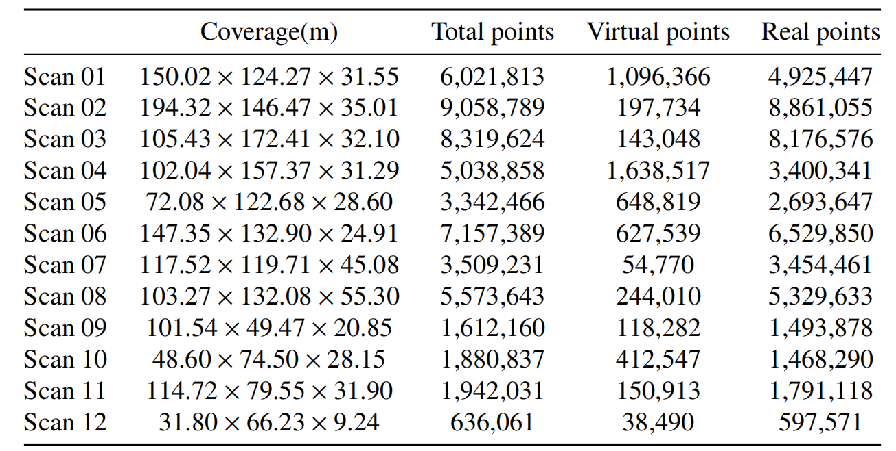

<h1 align="center"> <p> 3DRN</p></h1>

<h2 align="center"> A coupled optical–radiometric modeling approach to removing reflection noise in TLS data of urban areas</h2>

<p align="center">
<a href="" target="_blank">Li Fang</a><sup>a,e</sup>, 
<a href="" target="_blank">Tianyu Li</a><sup>a</sup>,
<a href="" target="_blank">Yanghong Lin</a><sup>b,e,*</sup>, 
<a href="" target="_blank">Shudong Zhou</a><sup>a</sup>,
<a href="" target="_blank">Wei Yao</a><sup>c,d</sup>,
</p>

<p align="center">
<sup>a</sup> Quanzhou Institute of Equipment Manufacturing Haixi Institutes, Chinese Academy of Sciences&nbsp;&nbsp; <br>
<sup>b</sup> Fujian Institute of Research on the Structure of Matter, Chinese Academy of Sciences&nbsp;&nbsp; <br>
<sup>c</sup> School of Engineering and Design, Technical University of Munich&nbsp;&nbsp; <br>
<sup>d</sup> GeoBIM & GeoNexus Intelligence&nbsp;&nbsp; <br>
<sup>e</sup> University of Chinese Academy of Sciences&nbsp;&nbsp; <br>
<sup>*</sup>Corresponding author. &nbsp;&nbsp; 
</p>

Point clouds, which are a fundamental type of 3D data, play an essential role in various applications like 3D reconstruction, autonomous driving, and robotics. However, point clouds captured via TLS frequently include false points caused by mirror-like reflective surfaces, resulting in degradation of data quality and fidelity. This study introduces an algorithm to eliminate reflection noise from TLS scan data. Our novel algorithm detects reflection planes by utilizing both geometric and physical characteristics to recognize reflection points according to optical reflection theory. Radiometric correction is applied to the raw laser intensity, after which reflective planes are extracted using a threshold. In the virtual points identification phase, these points are detected along the light transmission path, grounded on the specular reflection principle. Moreover, an improved feature descriptor, known as RE-LFSH, is employed to assess the similarity between two points in terms of reflection symmetry. We have adapted the LFSH feature descriptor to retain reflection features, mitigating interference from symmetrical architectural structures. Incorporating the Hausdorff feature distance into the algorithm fortifies its resistance to ghosting and deformations, thereby boosting the accuracy of virtual point detection. Additionally, to overcome the shortage of annotated datasets, a novel benchmark dataset named 3DRN, specifically designed for this task, is introduced. Extensive experiments on the 3DRN benchmark dataset, featuring diverse urban environments with virtual TLS reflection noise, show our algorithm improves precision and recall rates for 3D points in reflective areas by 57.03% and 31.80%, respectively. Our approach improves outlier detection by 9.17% and enhances accuracy by 5.65% compared to leading methods.

## 📌 Download Link
Please fill out this [**Data Request Form**](https://docs.google.com/forms/d/e/1FAIpQLSduYzDwNKti16dy4Xp9KJV6fii8fMJi3HiXg-jp6pjXDTdFGA/viewform?usp=header).
Download links will be sent automatically after completing the application.

## Pipeline


## 💡 3DRN Dataset Detail
The first introduced 3DRN contains 12 point cloud models with more than 55 million 3D points, collected by a terrestrial laser scanner (RIEGL VZ-2000i). All point cloud models are captured from real urban scene containing highly reflective areas with significant reflection noise, half of which are from Sanlinkou Innovation Park and the other half from Quanzhou Equipment Center. Each point in the point cloud model provides its XYZ position information and ground truth of the virtual points annotated by the professional. The zip file downloaded includes two data formats, *.txt and .npy, which are N*4 Arrays (XYZ and label, where label values ​​0 and 1 represent real point and virtual point, respectively). Figure shows a completed aerial view and partial scenes obtained after registration of all scan positions captured from the Sanlinkou Innovation Park, which clearly consists of real points and reflected virtual points. The table shows detailed statistical information about the dataset. 

<div align=center>
<div align=center>

## ☺ Citation
Please consider citing the following papers if you find the following papers benefit your work:

```
@article{FANG2025217,
title = {A coupled optical–radiometric modeling approach to removing reflection noise in TLS data of urban areas},
journal = {ISPRS Journal of Photogrammetry and Remote Sensing},
volume = {220},
pages = {217-231},
year = {2025},
issn = {0924-2716},
doi = {https://doi.org/10.1016/j.isprsjprs.2024.12.005},
url = {https://www.sciencedirect.com/science/article/pii/S0924271624004751},
author = {Li Fang and Tianyu Li and Yanghong Lin and Shudong Zhou and Wei Yao},
keywords = {TLS point clouds, Reflective surface detection, Reflection noise, Virtual point, Optical reflection model}
}

@article{fang2024robust,
  title={Robust Multiview Point Cloud Registration using Algebraic Connectivity and Spatial Compatibility},
  author={Fang, Li and Li, Tianyu and Zhou, Shudong and Lin, Yanghong},
  journal={IEEE Transactions on Geoscience and Remote Sensing},
  year={2024},
  publisher={IEEE}
}
```

## ✉ Citation
If you have any questions about the project, please feel free to contact us at linyanghong21@mails.ucas.ac.cn
